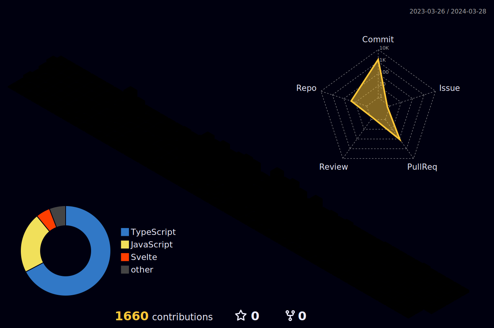

<h1 align="center">Hello I'm SeungGuk</h1>
<h3 align="center">Junior Front end Developer</h3>

 

👋 안녕하세요! 주니어 프론트엔드 개발자 유승국입니다.

📌 React와 NextJS를 사용하여 개발하고 있습니다.

🌱 성장하기 위해 매일 잔디를 심기 위하여 노력하고 있습니다.

 

## <b> Skills</b>

 

<b>📋 Languages</b>

 💅 <b>CSS</b>

📚 <b>Frameworks and Library</b>

 💾 <b>DB</b>

🌎 <b>Deploy</b>

🎛️ <b>Application and Tools</b>

 

